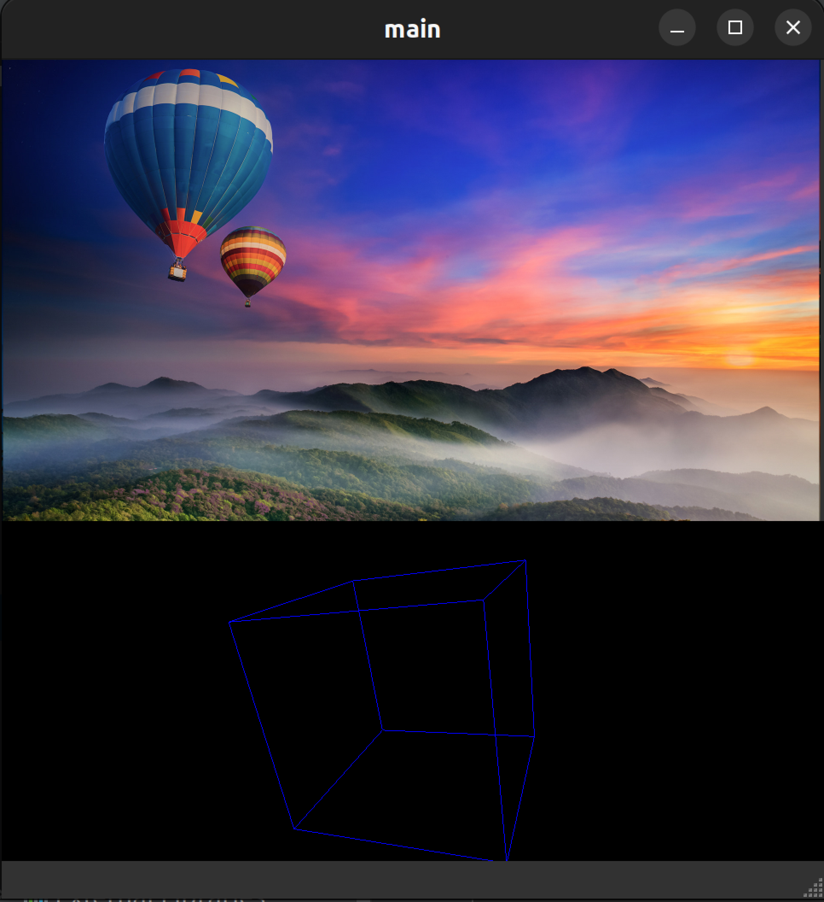

# pyqt6_workflow

Welcome to the pyqt6_workflow repository! This project aims to provide a simplified workflow for quickly starting new programs using PyQt6.

Say goodbye to manually writing complex UI layouts. With `QtDesigner`, you can easily create layouts through drag-and-drop, with a WYSIWYG (What You See Is What You Get) experience.

**[中文版本](README_zh.md)**

## Project Workflow for Application Development

1. Use `QtDesigner` to drag and drop components and create UI files -> `ui/*.ui`
2. Run `workflow.sh` to automatically generate Python files -> `ui/*.py`, `res/*.py`
3. Inherit from the `ui/*.py` files and write corresponding window logic functions -> `win/*.py`
4. Complete application development

## Installation

To get started, run the following command to install the required dependencies:

```bash
pip install pyqt6 pyqt6-tools pyside6
```

## QtDesigner

QtDesigner is a powerful tool that allows you to create layouts by dragging and dropping components, eliminating the need for manual layout control code. However, it requires a few additional steps involving `uic` and `pyside6-rcc`. Don't worry, we provide the following instructions, and the workflow.sh script is already set up to automatically search for files and perform the conversion, so there's no need to manually modify the script.

1. Run the following command to make the workflow script executable:
   - On Linux: `chmod +x workflow.sh`
   - For Windows users, please search for the corresponding steps. An automated Windows script will be added in the future.

**Pro Tip:** You can open this README.md file in PyCharm and click the adjacent green button to directly run the workflow script.

```bash
chmod +x workflow.sh
./workflow.sh
```

### Usage

- **designer**
  Use the following command to launch QtDesigner:

  ```bash
  pyqt6-tools designer
  ```

- **pyuic6**
  The `pyuic6` tool allows you to convert design files into Python files, making it more convenient to write code logic. If you don't have `uic` installed, you can run `pyqt6-tools installuic` to install it. Additionally, the `-x` flag generates a standalone executable window, and the `echo -e '' > file` command appends content to the end of the file (the `-e` flag enables recognition of `\n`).

  **Note:** The workflow.sh script is already set up to automatically search for files and perform the conversion, so there's no need to manually modify the script.

  ```bash
  pyuic6 -x ui/MainWindow.ui -o ui/MainWindow.py && echo -e "\nfrom res import resource_rc" >> ui/MainWindow.py
  ```

- **pyside6-rcc**
  This tool converts resource files into Python files, facilitating packaging and usage in QtDesigner. The `sed` command in the command replaces `PySide6` with `PyQt6` to ensure compatibility.

  **Note:** The workflow.sh script is already set up to automatically search for files and perform the conversion, so there's no need to manually modify the script.

  ```bash
  pyside6-rcc -g python ./res/resource.qrc | sed '0,/PySide6/s//PyQt6/' > ./res/resource_rc.py
  ```

Feel free to explore and make the most of the pyqt6_workflow repository. Happy coding!

